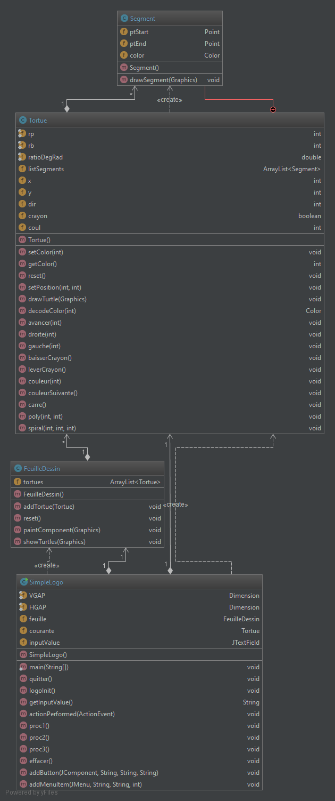

**Nom/Prénom Etudiant 1 :PETITCUENOT Mélanie**

**Nom/Prénom Etudiant 2 :DOLLE Jérémy**

# Rapport TP4

## Question 1
_Certaines methodes, par exemple la méthode *logoInit()* de la classe SimpleLogo, sont des méthodes qui devraient se 
trouver dans la vue car il s'agit de l'initilisation de celle-ci. Un autre exemple, la méthode *actionPerformed()* est 
une méthode que l'on doit retrouver dans un contrôleur (si l'on suit le pattern MVC).
 

## Question 2
*Rien à rédiger*

## Question 3
*Rien à rédiger*

## Question 4
*Rien à rédiger*

## Question 5
*Expliquer le code ajouté et représenter le patron de conception*

## Question 6
*Rien à rédiger*

## Question 7
*Rien à rédiger*

## Question 8
*Expliquer l'intérêt du mock*

## Question 9
*Montrer les résultats de vos rapports d'analyse*

## Question 10
*Rien à rédiger*
