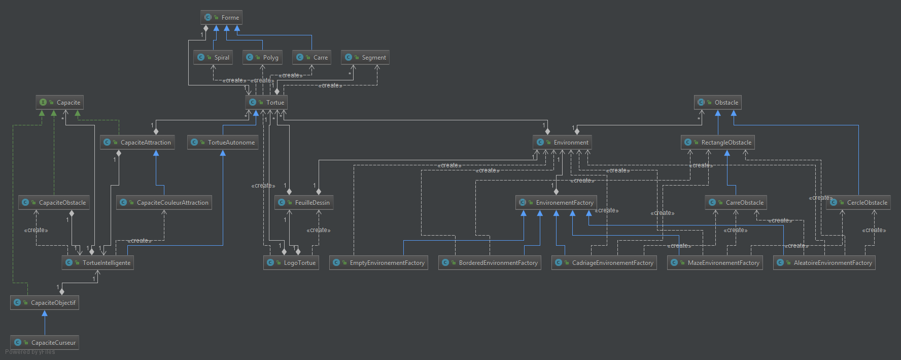
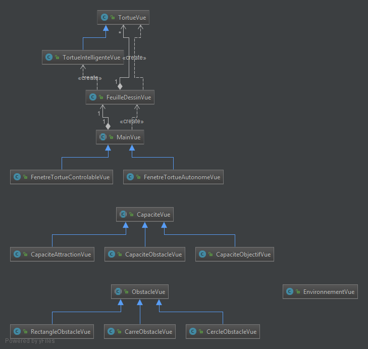
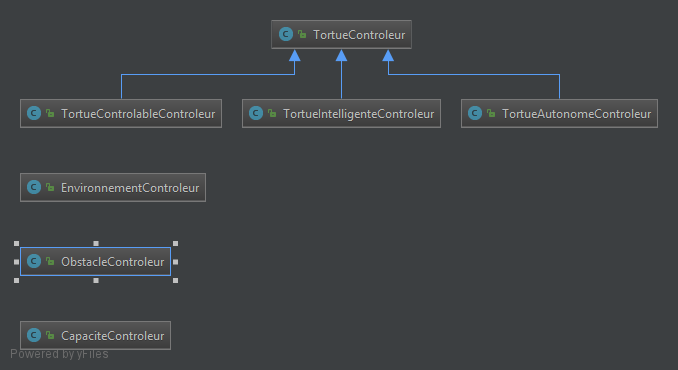
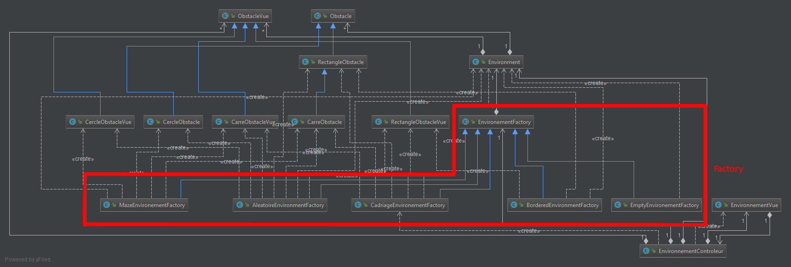
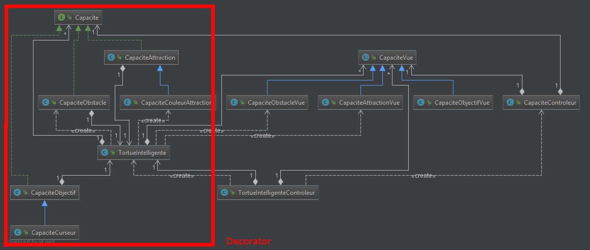
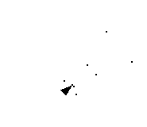

**PETITCUENOT Mélanie**

**DOLLE Jérémy**

# Rapport TP4

Lors de ce TP 4, nous avons mis en place 3 types d'agent que nous appeleront "tortue"
par la suite. Ainsi, lors de l'exécution du projet, vous pouvez choisir entre
des tortues controlables, autonomes ou intelligentes.

Nous allons détailler le code et les patterns utilisés uniquement pour les tortues
intelligentes car c'est pour ce type d'agent que nous en avons le plus utilisé.

Comme le digramme complet du projet est assez important, nous allons le morceler 
suivant les partterns utilisés afin de faciliter sa compréhension.

### MVC

Nous avons commencé par découper notre code en suivant le modèle MCV

##### *Modèle :*



##### *Vue :*



##### *Controleur :*




### Design Pattern Factory

Nous avons utilisé ce pattern afin de créer de nouveaux environnements facilement et
de pouvoir les interchanger sans modifier tout notre code.



Ainsi, dans la classe _EnvironementControleur_ se trouve un _EnvironementFactory_ qui nous permetra, 
lors de son instanciation de choisir le type d'environement qui sera généré. Ci dessous quelques exemples :
####Cadriage :
```java
public EnvironnementControleur() {
        this.environementFactory = new CadriageEnvironementFactory();
        this.environnementVue = new EnvironnementVue(this);
        listObstacleVue = new ArrayList<>();
        genererObstacles();
    }
```
####Bordure :
```java
public EnvironnementControleur() {
        this.environementFactory = new BorderedEnvironmentFactory();
        this.environnementVue = new EnvironnementVue(this);
        listObstacleVue = new ArrayList<>();
        genererObstacles();
    }
```
### Design Pattern Decorator

Nous avons utilisé ce pattern afin de créer de nouvelles capacités à nos tortues facilement. Il nous suffit
à présent de créer une classe implémentée par notre interface capacité puis de l'ajouter à la liste des
capaités de notre tortue.



Dans le coonstructeur de notre classe tortue intlligente, nous ajoutons les différentes capacitées désirées.

```java
 public TortueIntelligente() {
    super();
    this.listCapacites = new ArrayList<>();
    this.listCapacitesVues = new ArrayList<>();
    add(new CapaciteCouleurAttraction(this, 30),new CapaciteAttractionVue());
    add(new CapaciteCurseur(this), new CapaciteObjectifVue());
    add(new CapaciteObstacle(this,6,20,15),new CapaciteObstacleVue());
    add(new CapaciteObstacle(this,3,45,10),new CapaciteObstacleVue());
    add(new CapaciteObstacle(this,1,10,45),new CapaciteObstacleVue());
    add(new CapaciteObstacle(this,1,90,5),new CapaciteObstacleVue());
 }
```

Puis les capacités sont exécutées à chaque fois que la tortue avance.

```java
@Override
    public void avancer(ArrayList<Tortue> toutesLesTortues, Environment environment) {
        for (Capacite c : listCapacites) {
            c.lancerCapacité(environment);
        }
        super.avancer(toutesLesTortues, environment);
    }
```
Nous avons créé plusieurs types de capacités : 
 - Attraction
 - Attraction par couleur
 - Objectif
 - Curseur objectif
 - Détection d'obstacles
 
**Attraction & attraction par couleur**

Lorsque cette capacité est lancée, chaque tortue construit sa liste de voisin en fonction de la distance qui les sépares.
Il s’agit donc d'une sorte de champ d'attraction autour de chaque tortue. Donc, une fois la liste construite, 
une direction moyenne est créé est appliquée à chaque tortues qui sont voisines. De cette façon, les tortues vont partir sur la 
même direction.
Pour l'attraction par couleur, nous avons juste _extends_ la classe précédente et changer la façon de construire la liste des voisins.
Il suffit donc de vérifier non plus juste la distance qui sépare 2 tortue mais également la couleur de sa tête :

```java
@Override
    public void detecterVoisines(ArrayList<Tortue> toutesLesTortues) {
        List<Tortue> voisins = new ArrayList<>();
        for (Tortue autreTortue : toutesLesTortues) {
            if (currentTortue.equals(autreTortue)) {
                continue;
            }
            if (estDansMaVision(autreTortue)) {
                if(autreTortue.getTeteCouleur() == currentTortue.getTeteCouleur())
                    voisins.add(autreTortue);
            }
        }
        if (!voisins.contains(currentTortue))
            voisins.add(currentTortue);
        this.voisins = voisins;
    }
```

**Objectif et curseur objectif**

Pour arriver à cela, nous avons un point objectif au sein de cette capacité. Nous construisons un vecteur entre ce point objectif et les tortues.
nous avons ainsi la direction que nous appliquons à nos tortues.

Pour la capacité curseur objectif, nous avons _extends_ la capacité précédente en mettant à jour le point objectif avec la position du curseur sur l'écran.


**Détection d'obstacles**

Pour la détection d'obstacle nous avons choisi de créer des "moustaches" qui peuvent être réglées comme bon nous semble.
nous pouvons créer des moustache de la façon suivante :

```java
    new CapaciteObstacle(this,6,20,15)
```
Il y a donc 4 paramètres :
  - **la tortue intelligente**
  - **la distance** des moustaches (plus le chiffre est grand et plus la tortue va détecter les obstacle de loin)
  - **l'angle** ( il s'agit de l'angle que va provoquer la détection d'un obstacle ici 20. Donc si la moustache droite de la tortue touche un obstacle la tortue tourne de 20 degrés sur la droite)
  - **l'écart** (il s'agit de l'écartement entre la moustache droite et gauche)
  
Pour avoir quelque chose d'optimal il suffit de faire plusieurs moustaches. Certaine pour la détection de loin mais avec une déviation faible, certaines intermédiaires et pour finir des moustaches sur le nez de la tortue et à coté pour les effets de bord.

```java
    new CapaciteObstacle(this,6,20,15)
    new CapaciteObstacle(this,3,45,10)
    new CapaciteObstacle(this,1,10,45)
    new CapaciteObstacle(this,1,90,5)
```

