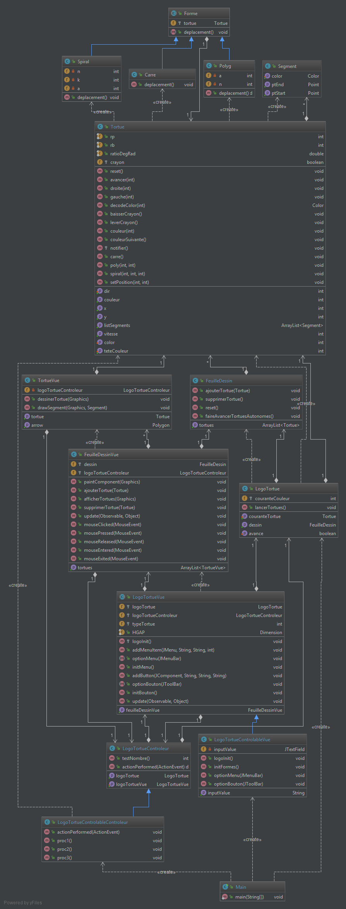

**PETITCUENOT Mélanie**

**DOLLE Jérémy**

# Rapport TP4

## Question 1
*Voir question 3*
## Question 2
*Rien à rédiger*

## Question 3

*UML du code initial :*

*UML après refactoring :*

## Question 4
*Rien à rédiger*

## Question 5

Nous avons implémenté une nouvelle classe *TortueAutonome* qui hérite de la classe *Tortue*.
Pour ce faire, nous avons mis en place un pattern inspiré du pattern stratégie.

## Question 6
*Rien à rédiger*

